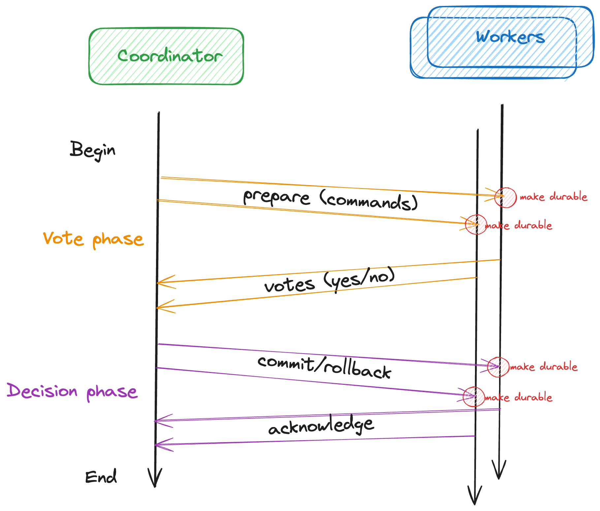

# Goal

Goal of this code is to simulate how the two phase commit protocol works.

# Two phase commit

Two phase commit protocol(2pc) solves problem of distributed transaction. Problem can be described: 
having multiple distributed systems (Workers) how to ensure that series of commands to these systems can be executed
atomically, meaning either all of them succeed or all of them fails (and are roll back).

## how 2pc works

2pc works on the assumption that there is a Coordinator which coordinates decision of transaction and Workers (nodes)
which are about to execute commands in distributed transaction.

The protocol works in two phases:
1. voting phase
2. decision phase

See diagram below:

During voting phase Coordinator sends commands to Workers and awaits for all responses. Worker when accepting 
command to prepare needs to decide if it accepts (votes yes) or rejects (votes no) command. After worker decides about
specific command it needs to store vote to durable store (so it is available in the case of Worker failure and restart).

Once Coordinator collects all votes it can decide if transaction should be committed (all yes votes) or to rollback (
some no votes) so it can inform Workers to either commit or rollback transaction. It's worth noting that if Worker gets
commit command it cannot change its mind and he is obliged to commit. Workers can decide only on voting phase.
